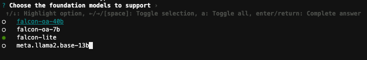

## Deploying Galileo

Before you start the deployment, make sure:

- Docker is running, with sufficient virtual disk space.
- Your AWS credentials are set up and available in the shell.
- You have reviewed the EULA before requesting access to Bedrock models.

### Using the CLI

!!! tip
    We recommend using the CLI for individuals, developer account, trials, and demos.

To deploy Galileo:

1. Open a CLI terminal and navigate to the Galileo directory.
2. Run these commands:

    ```
    export AWS_REGION={current aws region you're in}
    export AWS_PROFILE=default
    pnpm bootstrap-account
    pnpm galileo-cli deploy
    ```

    This will display a guided CLI workflow for input.

    !!! note

        If you get a `(node:12100) [EACCES] Error: spawn galileo-cli EACCES` message, ignore it.

    The following options are displayed for selecting a foundation model.

    

3. To navigate these prompts:

      - The circle filled green is the currently *selected* option. All other options are *unselected*.
      - The underlined and blue text option is the currently *highlighted* option.
      - Use the keyboard arrows **up** and **down** to move the currently highlighted option.
      - Use the **spacebar** to select/deselect the currently highlighted option.
      - To submit your final answer, press **Enter**.

4. Select the following options using the CLI:

      - AWS Profile: **default**
      - AWS Region: **(press Enter, the filled in region should be the correct region. If not, fill in the region code)**
      - Administrator email address: **(enter your email address)**
      - Administrator username: **admin**
      - Deploy main application stack?: **Y**
      - Choose the foundation models to suq:qpport: **(unselect all then press enter)**
      - Foundation model region?: **us-west-2**
      - Enable Bedrock?: **Y**
      - Bedrock Region: **us-west-2**
      - Bedrock model ids: **Anthropic Claude (anthropic.claude-v2)**
      - Bedrock endpoint url (optional): **(press Enter, should be blank)**
      - Choose the default foundation model: **bedrock::anthropic.claude-v2**
      - Press Enter for the rest of the prompts.

Your terminal displays this information:

```
    ____                            __             _  _  _                            _  _
   / __ \   __ _ __      __ ___    / /__ _   __ _ | |(_)| |  ___   ___           ___ | |(_)
  / / _` | / _` |\ \ /\ / // __|  / // _` | / _` || || || | / _ \ / _ \  _____  / __|| || |
 | | (_| || (_| | \ V  V / \__ \ / /| (_| || (_| || || || ||  __/| (_) ||_____|| (__ | || |
  \ \__,_| \__,_|  \_/\_/  |___//_/  \__, | \__,_||_||_||_| \___| \___/         \___||_||_|
   \____/                            |___/
✔ Config file name? … config.json
✔ Application Name (stack/resource naming) … Galileo
✔ AWS Profile … default
✔ AWS Region (app) … us-west-2
✔ Administrator email address Enter email address to automatically create Cognito admin user, otherwise leave blank
 … someone@somewhere.com
✔ Administrator username … yourusername
✔ Choose the foundation models to support ›
✔ Foundation model region? … us-west-2
✔ Enable Bedrock? … yes
✔ Bedrock region … us-west-2
✔ Loading available Bedrock models
✔ Bedrock model ids › Anthropic Claude (anthropic.claude-v2)
✔ Bedrock endpoint url (optional) …
✔ Choose the default foundation model › bedrock::anthropic.claude-v2
✔ Embedding model
Enter the model id to use for embeddings, supports any AutoML model

Example: sentence-transformers/all-mpnet-base-v2, intfloat/multilingual-e5-large, sentence-transformers/all-MiniLM-L6-v2
 … sentence-transformers/all-mpnet-base-v2
✔ Embedding Vector Size
Enter the vector size for the chosen embedding model
 … 768
✔ Embedding model instance type
Enable autoscaling the embedding instance capacity based

Recommend "ml.g4dn.xlarge" for smaller datasets, and "ml.g4dn.2xlarge" for larger datasets
 … ml.g4dn.xlarge
✔ Embedding model max capacity (autoscaling)
Enable autoscaling the embedding instance capacity based

Ensure adequate Service Quota limit for SageMaker > "ml.g4dn.xlarge for endpoint usage"
 … 1
✔ Indexing Pipeline instance type
Instance type used for processing dataset files and indexing to vector store
 … ml.t3.large
✔ Indexing Pipeline max containers
Number of containers used for indexing files to vector store

Ensure adequate Service Quota limit for SageMaker > "ml.t3.large for processing job"
 … 5
✔ Create vector store "index"?
If enabled, will create a database index for the data to improve search over large datasets

Recommended for very large datasets
 … no
✔ Deploy sample dataset? ›
✔ Enable tooling in dev stage (SageMaker Studio, PgAdmin)? ›
Synthesizing project repository...
? [CDK DEPLOY] Execute the following command in 615092085770?
cdk deploy --require-approval never --region us-west-2 --profile default -c "configPath=config.json" Dev/Galileo
 … yes
```

!!! info

    It takes about 40 minutes to build and deploy everything. While we wait, continue to the next page to have a look at how this project was built and how to extend it.

#### Updating configuration settings

The CLI will generate an application configuration file in demo/infra/config.json, which will persist your configuration. You can modify this file and redeploy to change the configuration, or use the CLI.

`pnpm run galileo-cli --help` for cli help info

For more details on CLI operations, refer to the [CLI page](../../developer-guide/cli).

!!! info "Cross-Region deployments"
    Galileo CLI allows you to deploy your LLM stack and application stack into different Regions.

### Using a CI/CD pipeline

!!! tip
    We recommend using the CI/CD pipeline deployment method for live services and for shared team accounts.

**Note**: Make sure your AWS credentials in your shell are correct.

1. Create a CodeCommit repository in your target account/Region name "galileo".
2. Push this git repository to the `mainline` branch
3. Run `pnpm run deploy:pipeline`

### Deploying manually

!!! tip
    We recommend using a manual deployment method only if you need to have full control and want to modify the application.

```sh
pnpm install
pnpm build

cd demo/infra
pnpm exec cdk deploy --app cdk.out --require-approval never Dev/Galileo
pnpm exec cdk deploy --app cdk.out --require-approval never Dev/Galileo-SampleDataset # (optional)
```

## What is deployed?

As part of the deployment, the following services are deployed in your AWS account:

- A pre-built conversational UI that enables contextual conversation with memory,
- An optimized embeddings vector store based on RDS Postgres and `pgvector`,
- A scalable and elastic data ingestion pipeline,
- A low latency text embeddings inference engine,
- Retrieval augmented generation (RAG) features, and
- A choice of open source large language models.


## Next steps

- [Validate the deployment](validate-deployment.md)
- [Set up Cloud9 as your development environment](cloud9-ide.md)
