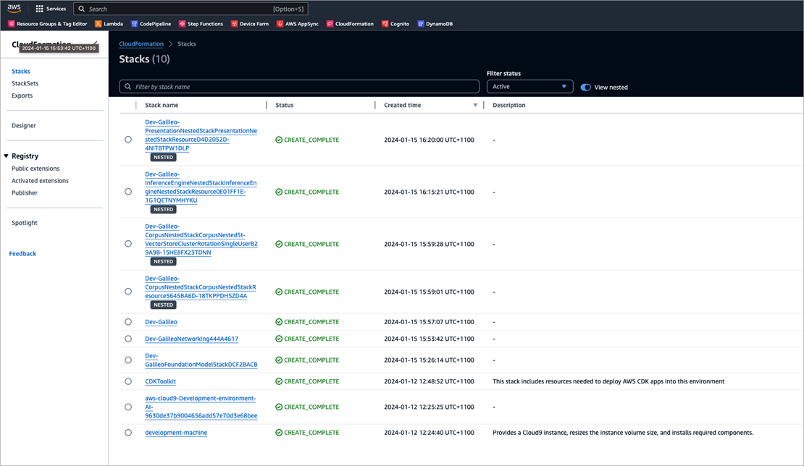
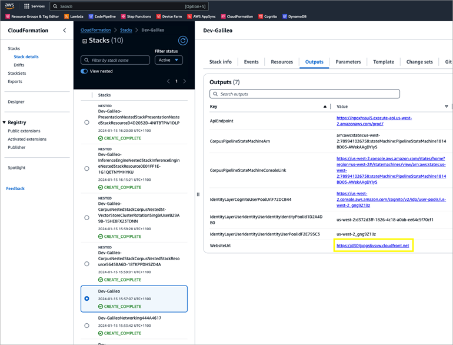
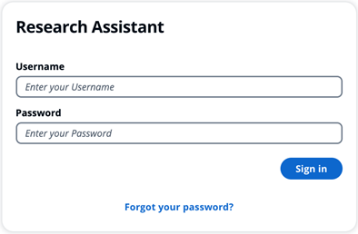
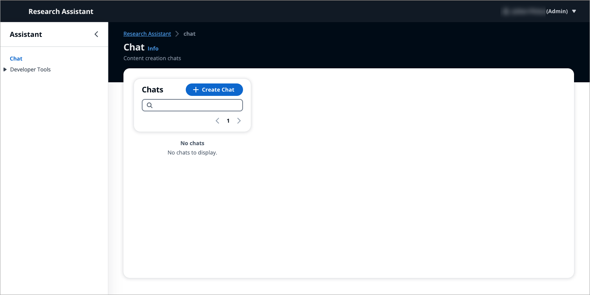

## Validating the deployment

To confirm that the Galileo application has been deployed and ready for use:

1. In your AWS console, type "CloudFormation" in the top search bar and select **AWS CloudFormation** from the service list.
2. On the CloudFormation page, from the left, select **Stacks**.
3. If the deployment has been successfully completed, you will see a number of stacks with a `CREATE_COMPLETE` status.
    

    If there are any stacks that are still in progress, wait until they are all complete.

## Reviewing the application

To check if the application has deployed successfully:

1. From the Stacks page, choose the **Dev-Galileo** stack.
2. Select the **Outputs** tab to see a list of key value pairs for `WebsiteUrl`.
    

3. Select to open the url value of `WebsiteUrl`. If the application deployed and is running successfully, a login screen is displayed.
    

4. Use your `admin` username and password (received via email) to sign in to the UI. The UI chat page displays.
    
